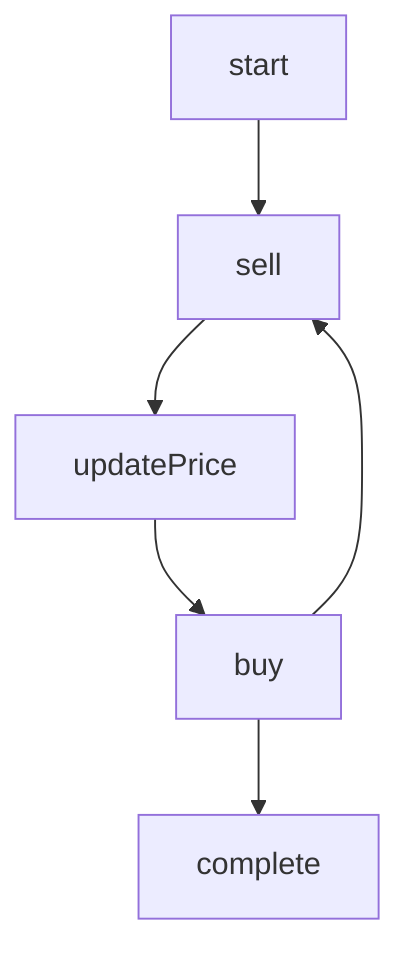

# ABM Simulation Example

The simulation demonstrates the creation of offers, their price fluctuations based on supply and demand, and the processing of purchases. It demonstrates loops and dynamic routing.

- Start: Initializes the marketplace with a starting offer.
- Seller: Represents sellers creating or updating offers.
- Price Update: Adjusts offer prices based on simulated market conditions.
- Buyer: Simulates buyers placing orders, affecting the available quantity of offers.
- Complete: Marks the completion of the simulation.

