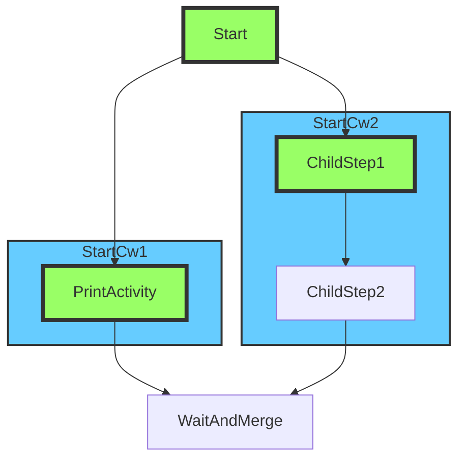

# Parallel Workflows

This example uses two parallel child workflows to demonstrate paralleism.

```
Print: parent workflow start
Starting child workflow '900eef73-57c1-4891-a95b-b619f0e7f86d'
Activity message: Hello from co2 (1), received: Child workflow '900eef73-57c1-4891-a95b-b619f0e7f86d' says hello, got input: parent workflow start
Starting child workflow '3958c882-f98b-4458-8809-237810aaed28'
Activity message: Hello from co2 (2), received: Hello from co2 (1)
Activity message: Hello from co1, received: Child workflow '3958c882-f98b-4458-8809-237810aaed28' says hello, got input: parent workflow start
Workflow completed with output: Hello from co1Hello from co2 (2)
```

Uncomment the demo exports section to generate the diagram.

